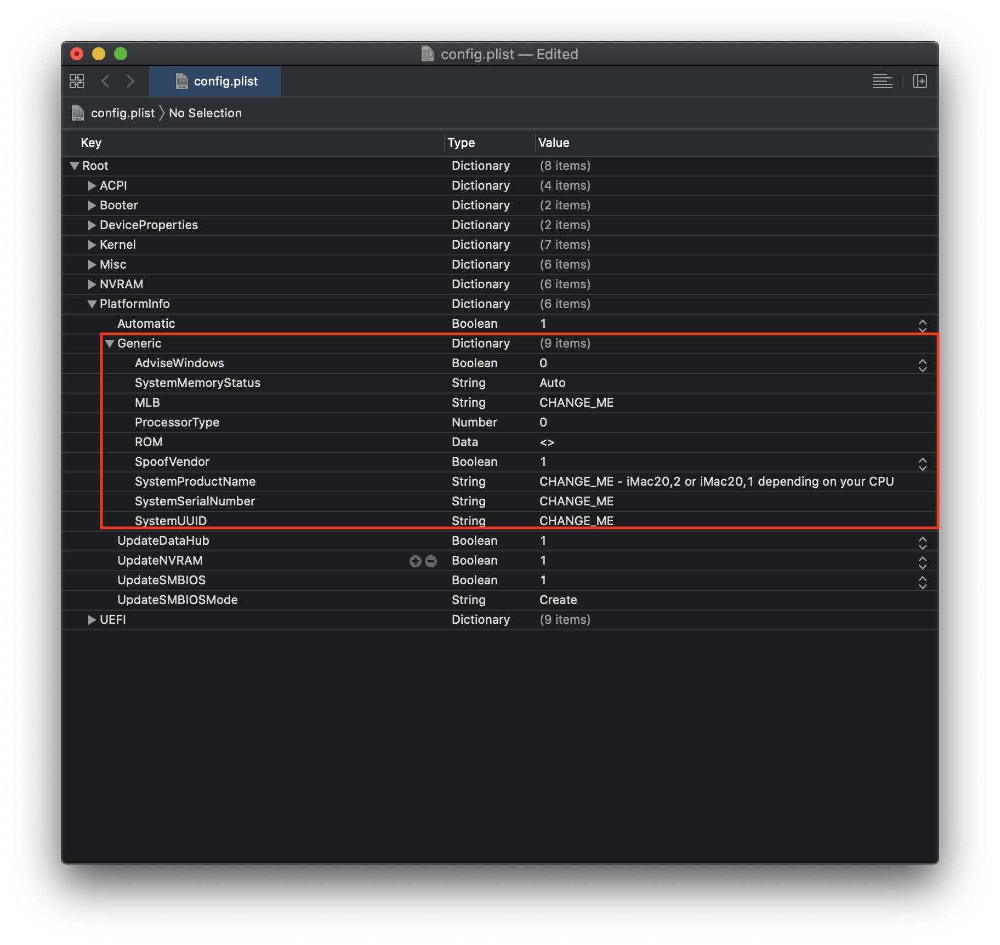

## Hackintosh Gigabyte Z490 Aorus Ultra

I didn't find any specific tutorial for this mobo so I decided to share my EFI folder to maybe save someone else some time and frustration 😊  

⚠️ **Please follow the [OC tutorial](https://dortania.github.io/OpenCore-Install-Guide/) - don't use my configuration if you have a different motherboard!** ⚠️  

#### My configuration:

| Part | Model |
|------|-------|
|Motherboard|Gigabyte Z490 Aorus Ultra, Bios v F6|
|CPU | Intel i7-10700K @ 3.8 GHz | 
|Cooler | Scythe Mugen 5 PCGH | 
| GPU | Sapphire Nitro+ Radeon RX 5700 XT 8G | 
| RAM | Corsair Vengeance RGB PRO DDR4 64GB @ 3600 MHz |
| Storage | ADATA XPG SX8200 Pro 1TB M.2 | 
| Wifi | Fenvi T919 Wireless PCI | 
| Case | NZXT H510i | 
| PSU | Thermaltake Toughpower Grand 1200W 80 Plus Platinum |

#### What works:  

- Ethernet - with [IntelMausiEthernet](https://github.com/Mieze/IntelMausiEthernet)  
- Airdrop  
- Sleep  
- iServices (iMessage, Facetime, iCloud)  
- Sound  
- USB (including USB-C)  
- Wifi (Fenvi T919 is natively supported)  

#### What doesn't work:  

- DRM (Netflix & co) - the solution is to disable the iGPU in BIOS  
- unlocking with Apple Watch as I can't seem to disable internal Wifi+Bluetooth  

#### Usage  

⚠️ If you do decide to use my EFI folder, make sure to generate your own serial numbers with [GenSMBIOS](https://github.com/corpnewt/GenSMBIOS) for either `iMac20,1` or `iMac20,2` (depending on your CPU) and add them in the [config.plist](EFI/OC/config.plist) in the `PlatformInfo > Generic` section: 

Comments and PRs are appreciated!

#### Credits

[OpenCore](https://dortania.github.io/OpenCore-Install-Guide/)  
[SchmockLord's repo](https://github.com/SchmockLord/Hackintosh-Intel-i9-10900k-Gigabyte-Z490-Vision-D)  
